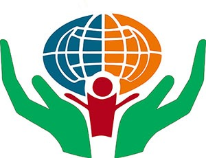

## CREANDO HUELLAS 

Proyecto de Inteligencia Colectiva y Formación en la Empresa 

[Master en Gestión y Tecnologías de Procesos de Negocio](https://masteres.ugr.es/mbagestiontic/)

ETS Ingeniería Informatica y de Telecomunicación Univesidad de Granada  

----

**Titulo** : Creando huellas

**Autor(es)** 
Alejandro Steven Rodríguez; Juan Jose Tisnado; Hexon Lizcano y Yulian García Zayas Bazán

**Resumen** : 
Nuestra comunidad se compromete con la integración de los migrantes en sus nuevos países, reconociendo la importancia de la migración cultural en la construcción de sociedades diversas y prósperas. Entendemos que la migración cultural no se trata solo de trasladarse físicamente a un nuevo lugar, sino también de adaptarse a nuevas formas de vida, valores y tradiciones.
Nos esforzamos por ofrecer una variedad de ayudas sociales diseñadas para apoyar a los migrantes en todas las facetas de su vida en el nuevo país. Esto incluye servicios de asesoramiento y orientación, asistencia para encontrar vivienda y empleo, clases de idiomas, programas de formación y educación, apoyo psicológico y social, y acceso a recursos comunitarios. Todo ello, mediante el intercambio de las experiencias de los miembros de la comunidad.
Así, no solo proporcionamos ayuda a corto plazo, sino también empoderar a los migrantes para que se conviertan en miembros activos y contribuyentes de la sociedad. Esto implica facilitar oportunidades para que participen en la vida comunitaria, promover la comprensión intercultural y fomentar el respeto mutuo entre todas las personas, independientemente de su origen cultural.

**logotipo** :  

**Slogan**: Siéntete como en casa

**Hashtag** 
#CreandoHuellas
#SienteteComoEnCasa
#MigracionIntercultural

**Licencia**    (usar una creative commons: revisar en https://creativecommons.org/licenses/?lang=es_ES) 

**Fecha** : 30 de abril de 2024

**Medios**: 
*  :octocat: (github url)
* Notion
* X
* Facebook / Messenger
* Canal de Telegram

----

### ¿Quiénes somos?

### Misión
Facilitar la transición y la integración de los migrantes en sus nuevos países, ofreciendo apoyo integral y oportunidades para su desarrollo personal y profesional. Nos comprometemos a proporcionar servicios de alta calidad que promuevan la inclusión social, la igualdad de oportunidades y el respeto a la diversidad cultural, trabajando en colaboración con las comunidades locales y las instituciones pertinentes.

#### Visión
Nos visualizamos como líderes en el campo de la acogida y la integración de migrantes, reconocidos por nuestro compromiso con la excelencia, la innovación y el impacto positivo en la vida de las personas. Nos esforzamos por construir sociedades inclusivas y cohesionadas, donde todos los individuos, independientemente de su origen cultural, puedan prosperar y contribuir plenamente al desarrollo de sus comunidades. Nuestra visión es un mundo donde la migración cultural sea valorada y celebrada como una fuente de enriquecimiento y crecimiento para todos.

----- 

### Metodología

Metodología de desarrollo: Diseño de contenidos digitales mediante estrategia de diseño de Experiencias de usuario (UX experiences) 

### Etapa 1: Ideación de proyecto 

Actividades realizadas mediante Trello https://trello.com/b/3YjvDccp/proyectomultimedia

**¿Como surge el proyecto?**

**Investigación de campo**   Desk research propuestas inspiradoras para el proyecto) 

* @LadyDistopia (link) ...¿ por qué ?
* (...)
* 

#### Necesidad/oportunidad

#### Motivación de la propuesta

¿ por qué consideras interesante ? 

#### Personas/Usuarios
(...¿en quién piensas que puede ser útil ? ¿cual es tu publico objetivo?) 

### Etapa 2: Prototipar / productos 

(Productos que has desarrollado y como se plantea la integración de los diferentes medios, pon los que uses) 

* Imagen visual (Portada / Diseño de Interfaz) y herramienta usada 

* redes sociales (...) 

* publicidad: banner (... ) 

* ...

### Etapa 3: Técnicas de evaluación utilizadas

(Estrategia que plantearías para evaluar tu propuesta, medidodes e indicadores de éxito, elige / propone) 

#### Test con usuarios (...) 

#### Preguntas frecuentes

### Conclusiones y trabajo futuro

* Grado de consecución del proyecto 
* Problemas identificados  (técnicos / sobre la idea inicial / planificacion… ) 
* Propuestas de mejora (por qué consideras que merece la pena continuar)
* Posible interés del proyecto (¿ Quien podría  colaborar / involucrarse en el proyecto? ¿viable?)

Referencias y recursos: 

* Artículos ..  
* Productos utilizados  
* Propuestas de mejora

(...)

----

**Referencias y recursos utilizados** :

* [Proceso UX](https://uxmastery.com/resources/process/)
* [Diseño de Experiencias UX](http://www.nosolousabilidad.com/articulos/uxd.htm) 
* [Métodos UX](https://mgea.github.io/UX-DIU-Checklist/index.html) 
* [MuseMap: ejemplo de experiencia UX](https://blog.prototypr.io/musemap-street-art-app-ux-case-study-9bec6a99823b) 
* (...) 

(...)
* (Artículos ..  )
* (Productos utilizados ) 
* (Recursos tipo Imágenes, videos , etc.) 

